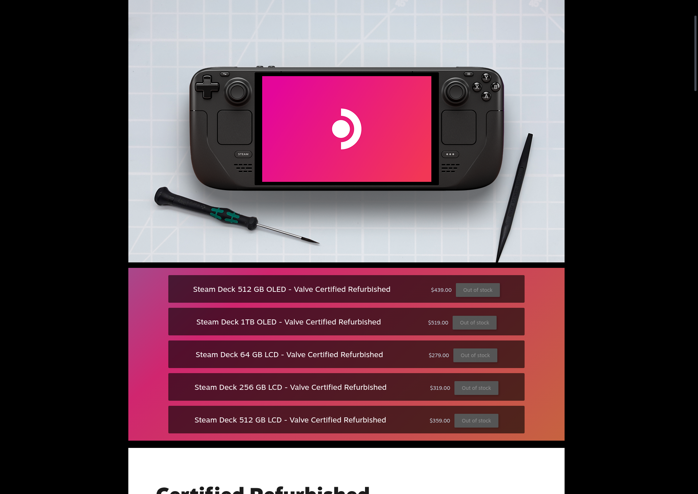

# Steam Deck Refurbished Stock Checker

## Description

This project provides a script to monitor the availability of refurbished Steam Deck units on the official store page and send a notification to a specified Discord channel when stock is detected. The script uses Selenium for web scraping and a Discord webhook for notifications.



## Setup with Docker compose
```yaml
services:
  steam_deck-notifier:
    image: minituff/steam-deck-refurbished-stock-checker
    container_name: minituff/steam-deck-refurbished-stock-checker
    hostname: minituff/steam-deck-refurbished-stock-checker
    restart: unless-stopped
    environment:
      - DISCORD_WEBHOOK_URL=
      - CRON_SCHEDULE=*/5 * * * * # Every 5 minutess
      - TZ=America/Los_Angeles
      - RUN_ON_START=false
      # Comma seperated list from https://store.steampowered.com/sale/steamdeckrefurbished
      - PRODUCT_TITLES=Steam Deck 512GB OLED - Valve Certified Refurbished,Steam Deck 1TB OLED - Valve Certified Refurbished 
```
## Discord Webook URL
This can be obtained by following these steps in your Discord server:
* `Server settings` -> `Apps` -> `Integrations` -> `Webhooks` -> `New Webook` *Name it* -> `Copy Webhook URL`

## Disclaimer

This script is provided "as is" for personal use. Be aware of website scraping policies and use responsibly.